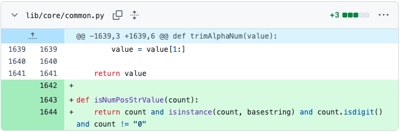

# 用户实验介绍：任务 3

## 实验环境配置

请通过以下命令配置环境，用于测试编辑结果：

```bash
conda create --name env_3 python=3.XX -y
conda activate env_3
pip install xxx
```

## 任务介绍

Sqlmap 是一个开源的SQL注入检测和利用工具，专门用于渗透测试和安全评估。

Sqlmap 在 `plugins/generic/enumeration.py` 中多次使用 `if not count.isdigit() or not len(count) or count == "0":` 判断 `count` 不是一个正整数。

但是开发者在这些位置碰到了 `AttributeError: 'NoneType' object has no attribute 'isdigit'` 的问题。为了增强代码健壮性，同时精简代码，开发者把这一段判断逻辑优化并提取为一个函数 `is_positive_int`，如下图所示:



你可以前往 [`lib/core/common.py`](lib/core/common.py)，复制以下内容完成该初始修改：

```python

def isNumPosStrValue(count):
    return count and isinstance(count, basestring) and count.isdigit() and count != "0"
```

请你在完成该初始修改后，完成该重构任务。

> ⚠️ **温馨提示**
>
> * **初始编辑包含在内**，一共需要完成 **14** 处修改
>
> * 所有的修改都不需要新增/删除/重命名任何文件
>
> * 你可以在项目根目录下运行 `python count.py` 来查看和统计已经完成的编辑数量
>
> * 编辑数量**仅供参考**，请根据[验证修改](#验证修改)来判断是否完成修改目标

## 编辑描述

当你需要输入编辑描述时，你可以直接复制以下内容：

```bash
fix for a bug reported by ToR: AttributeError: 'NoneType' object has no attribute 'isdigit'
```

如果你所在的实验组使用的后端模型是 Claude Code，你可以输入任意内容和 Claude Code 沟通。

## 验证修改

请运行一下命令验证修改是否成功

```bash

```

当修改正确时，你应该看到以下内容：

```bash

```

恭喜你成功完成该任务，你可以告知实验负责人，停止录屏，整理需要提交的内容，并在**所有任务**完成后，打包提交。
